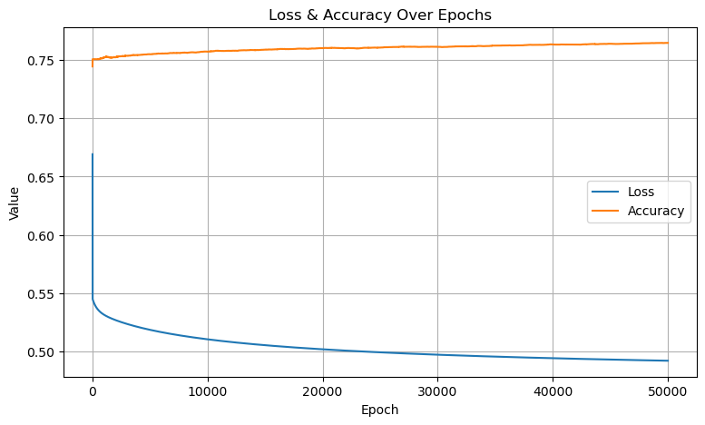
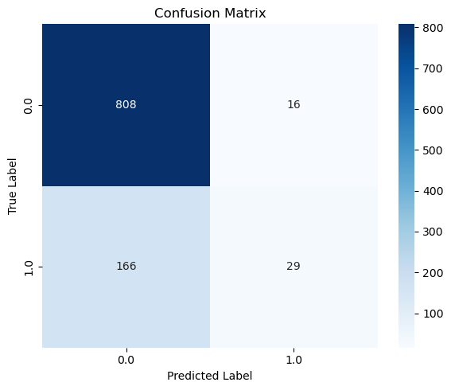
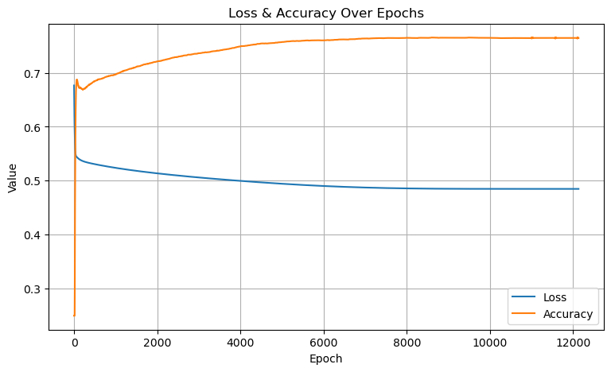
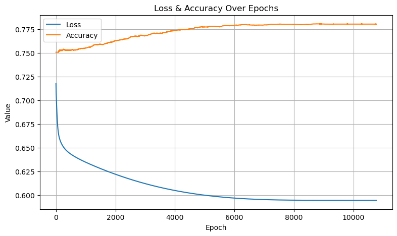
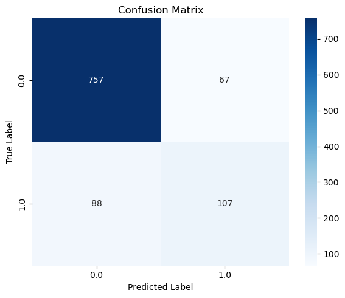

# Job Change Prediction: Logistic Regression from Scratch

**Predicting job change of data scientists using Logistic Regression built from scratch with NumPy**

## Table of Contents

1. [Introduction](#introduction)
2. [Dataset](#dataset)
3. [Methodology](#methodology)
4. [Installation & Setup](#installation--setup)
5. [Usage](#usage)
6. [Results](#results)
7. [Project Structure](#project-structure)
8. [Challenges & Solutions](#challenges--solutions)
9. [Future Improvements](#future-improvements)
10. [Contributors](#contributors)
11. [Contact](#contact)
12. [License](#license)

---

## Introduction

### Problem Statement
"Are you looking for job change?" \
"Why do our employees switch jobs so often?"\
-> We have so many questions out there about **job change**.

This project aims to **predict the probability that a data scientist will change jobs** based on personal and professional characteristics. This is a **binary classification** problem where I predict whether an employee will switch companies or stay.

### Motivation & Real-world Applications
- **Talent Retention**: Companies can proactively identify employees likely to leave and implement retention strategies.
- **HR Optimization**: Better understanding of factors influencing job change decisions enables more efficient human resource management.
- **Labor Market Research**: Analyze job transition trends in the technology sector and provide data-driven insights.
- **Strategic Planning**: Help organizations allocate resources to retain high-value employees.

### Specific Objectives
1. **Build Logistic Regression from scratch** using NumPy (without scikit-learn).
2. **Perform comprehensive Exploratory Data Analysis (EDA)** to understand influencing factors.
3. **Give a valuable questions**: answer it using Numpy to get insights.
4. **Implement optimization algorithms** (Gradient Descent and Adam Optimizer).
5. **Achieve high performance** on test sets and balance key metrics (Accuracy, Precision, Recall, F1-Score).

---

## Dataset

### Data Source
- **Dataset Name**: [HR Analytics: Job Change of Data Scientists](https://www.kaggle.com/datasets/arashnic/hr-analytics-job-change-of-data-scientists)
- **Location**: `data/raw/aug_train.csv` (training data) and `data/raw/aug_test.csv` (test data)

### Feature Descriptions

| Feature | Type | Description |
|---------|------|-------------|
| `enrollee_id` | ID | Unique identifier for candidate |
| `city` | Categorical | City code |
| `city_development_index` | Numeric | Development index of the city (0-1 scale) |
| `gender` | Categorical | Gender (Male, Female, Other, Missing) |
| `relevent_experience` | Categorical | Relevant work experience (Has/No relevent experience) |
| `enrolled_university` | Categorical | Type of university course enrolled, if any |
| `education_level` | Categorical | Education level (Graduate, High School, etc.) |
| `major_discipline` | Categorical | Major discipline (STEM, Business, Humanities, Other) |
| `experience` |  Categorical  | Years of work experience |
| `company_size` | Categorical | Size of current company |
| `company_type` | Categorical | Type of company (Pvt Ltd, NGO, Government, etc.) |
| `last_new_job` | Numeric | Years since last job change |
| `training_hours` | Numeric | Training hours completed |
| **`target`** | **Binary** | **Prediction target: 1 = Will change job, 0 = Will not change** |

### Dataset Characteristics

```
- Total training samples: 19,158 candidates
- Total test samples: 2,129 candidates
- Number of initial features: 13 (14 if target included)
- Missing data: Multiple features contain NaN values
- Class imbalance: Imbalanced target (biased towards class 0)
- Data types: 4 numeric features (id included), 9 categorical features
```

More details: Read the [Notebook 01 Data Exploration](notebooks/01_data_exploration.ipynb).

---

## Methodology

### 1. Data Processing Pipeline (Preprocessing)

#### 1.1 Exploratory Data Analysis (EDA)
- **Data Loading**: Read CSV files using NumPy (without pandas)
- **Type Detection**: Distinguish between numeric and categorical features
- **Missing Value Analysis**: Calculate missing data percentage per feature
- **Data Visualization**: 
  - Histograms for numeric features
  - Bar charts for categorical features
  - Analysis of job change rates by city, experience, training hours, etc.
- **Answer questions**: Answer questions that I asked to get more insights about data.  
    - Visualize results user barplot.

#### 1.2 Data Cleaning & Transformation

**Numeric Features**:

1. **`city_development_index`**:
   - No missing values detected
   - Retain as-is for model training

2. **`training_hours`**:
   - Highly right-skewed distribution
   - Apply **Log Transformation**: $x' = \log(x + 1e^{-8})$
   - Converts skewed distribution to approximately normal, stabilizing model convergence

**Categorical Features** (NumPy-only ordinal/nominal encoding):

1. **`gender`** (3 categories: Male, Female, Other + Missing):
   - **Encoding Strategy**: Symmetric coding preserving gender distinctions
     - Male → 1
     - Female → -1  
     - Other/Missing → 0
   - Rationale: Non-binary and missing values both represent absence of clear gender identification

2. **`relevent_experience`** (Binary: Yes/No):
   - Encoding: Yes → 1, No → 0

3. **`enrolled_university`** (3 categories + Missing):
   - **Ordinal encoding by engagement level**:
     - Full-time course → 2
     - Part-time course → 1
     - No enrollment/Missing → 0

4. **`education_level`** (6 categories + Missing):
   - **Ordinal encoding by academic progression**:
     - Unknown/Missing → 0
     - Primary School → 1
     - High School → 2
     - Graduate → 3
     - Masters → 4
     - PhD → 5

5. **`major_discipline`** (5 categories):
   - **Binary encoding** (STEM-dominated in EDA):
     - STEM → 1
     - Non-STEM (Business, Humanities, Other) → 0

6. **`experience`** (Mixed types: numeric + special categories `<1`, `>20`):
   - **Unified numeric conversion**:
     - `<1` → 0
     - `"1"` to `"20"` → converted to integers
     - `>20` → 21
     - Missing (`""`) → 0
   - Result: Continuous numeric scale [0, 21] years

7. **`company_size`** (8 categories, ~30% missing):
   - **Ordinal encoding**:
     - `<10` → 0, `10/49` → 1, `50-99` → 2, `100-500` → 3
     - `500-999` → 4, `1000-4999` → 5, `5000-9999` → 6, `10000+` → 7
   - **Missing value imputation via K-Nearest Neighbors (KNN)**:
     - Use k=5 nearest neighbors
     - Features used: gender, relevent_experience, enrolled_university, education_level, major_discipline, experience, training_hours, city_development_index
     - Distance metric: Euclidean distance in 8D feature space
     - Prediction: Majority vote among k neighbors
     - Rationale: Preserves relationships between company characteristics and organizational size

8. **`company_type`** (6 categories, ~32% missing):
   - **Nominal encoding**:
     - Other → 0, NGO → 1, Early Stage Startup → 2
     - Public Sector → 3, Funded Startup → 4, Pvt Ltd → 5
   - **Missing value imputation via KNN**:
     - Same k=5 neighbors, same 8 features as company_size
     - Majority vote to assign company type
     - Rationale: Avoids bias from defaulting to most frequent category (`Pvt Ltd`)

9. **`last_new_job`** (Special category + numeric):
   - **Ordinal encoding**:
     - `"never"` (never changed) / Missing → 0
     - `"1"` to `"4"` → direct integer conversion
     - `">4"` → 5
   - Minimal missing (2%) so filling as 0 is acceptable

10. **`city`** (120+ unique cities):
    - **Frequency Encoding** (avoids high-dimensional one-hot encoding):
      - Each city replaced by its occurrence count in the dataset
      - Preserves popularity information without explosion in features
      - Frequency encode value is saved to `processed/freq_encode.json` for later use.
    - **Standardization** (z-score normalization):
      - City frequencies have much larger scale than other features
      - Apply: $x' = \frac{x - \mu}{\sigma}$ to normalize to comparable range
      - Parameters saved to `processed/mean_std.txt` for consistent test-set transformation

#### 1.3 Output Data Format

**Files saved to `data/processed/`:**

1. **`preprocessed_data.csv`** (19,158 rows × 13 columns):
   - **Format**: CSV with all features and target encoded
   - **Columns** (in order):
     - `city_dev_index`: Numeric (0.624 to 0.926) - City development index, no transformations
     - `training_hour`: Log-transformed numeric (~1.9 to 5.3) - Training hours in log scale
     - `gender`: Encoded ordinal (-1=Female, 0=Other/Missing, 1=Male) - Symmetric coding
     - `relevent_exp`: Binary (0=No, 1=Yes) - Has relevant experience
     - `enrolled_uni`: Ordinal (0=No enrollment, 1=Full time, 2=Part time) - University enrollment type
     - `education_level`: Ordinal (0=Missing, 1=High School, 2=Graduate, 3=Masters, 4=PhD, 5=Other) - Education progression
     - `major`: Binary (0=Non-STEM, 1=STEM) - Major discipline
     - `experience`: Numeric (0-21 years) - Years of work experience, unified scale
     - `company_size`: Ordinal (0-7) - Company size categories
     - `company_type`: Ordinal (0-5) - Company type categories
     - `last_new_job`: Ordinal (0-5) - Years since last job change
     - `city`: Numeric (frequency-encoded & standardized, range ~-1.0 to 1.6) - City frequency encoding with z-score normalization
     - `target`: Binary (0=Won't change, 1=Will change) - Job change prediction target

2. **`freq_encode.json`** (120 city entries):
   - **Format**: JSON dictionary mapping city codes to frequency counts
   - **Purpose**: Records frequency of each city in training data before standardization
   - **Example entries**: 
     ```json
     {
       "city_103": 4355,  // Most frequent city
       "city_21": 2702,
       "city_16": 1533,
       ...
       "city_171": 1     // Least frequent cities
     }
     ```
   - **Usage**: Apply same mapping to test data to ensure consistent encoding

3. **`mean_std.txt`** (1 line, 2 numbers):
   - **Format**: Comma-separated values: `mean,std`
   - **Content**: `1709.7964296899468,1669.8916310361965`
   - **Purpose**: Standardization parameters for city frequency encoding
   - **Usage**: Apply to test set: $x'_{test} = \frac{x_{test} - 1709.80}{1669.89}$
   - **Why saved**: Ensures test set preprocessing maintains same distribution as training


**Preprocessing Applied Summary**:
| Feature | Original Type | Encoding | Missing Handling | Scale | Output Range |
|---------|---------------|----------|------------------|-------|--------------|
| city_dev_index | Numeric | None (retain) | 0 missing | Min-Max | [0.624, 0.926] |
| training_hours | Numeric (0-337) | Log transform | 0 missing | Log scale | [1.9, 5.3] |
| gender | Categorical (4) | Symmetric ordinal | Included as 0 | Integer | {-1, 0, 1} |
| relevent_experience | Categorical (2) | Binary | 0 missing | Integer | {0, 1} |
| enrolled_university | Categorical (3) | Ordinal | Included as 0 | Integer | {0, 1, 2} |
| education_level | Categorical (5) | Ordinal | Included as 0 | Integer | {0, 1, 2, 3, 4, 5} |
| major_discipline | Categorical (5) | Binary (STEM) | 0 missing | Integer | {0, 1} |
| experience | Mixed (numeric + special) | Unified numeric | Standardized | Numeric | [0, 21] |
| company_size | Categorical (8) | Ordinal | KNN imputation (k=5) | Integer | {0-7} |
| company_type | Categorical (6) | Ordinal | KNN imputation (k=5) | Integer | {0-5} |
| last_new_job | Mixed | Ordinal | Fill missing as 0 | Numeric | [0, 5] |
| city | Categorical (120+) | Frequency → Z-score | 0 missing | Standardized | [-1.0, 1.6] |
| **target** | **Binary** | **None** | **0 missing** | **Integer** | **{0, 1}** |

### 2. Algorithms

#### 2.1 K-Nearest Neighbors (KNN) for Imputation

**Purpose**: Handle missing values in categorical features (company_size, company_type) by predicting them based on similar records.

**Algorithm Overview**:

1. **Identify training and test sets**:
   - Training set: All records with known feature values
   - Test set: Records with missing values for the target feature

2. **Distance Metric** (Euclidean distance):
   $$d(\mathbf{x}_i, \mathbf{x}_j) = \sqrt{\sum_{f=1}^{n} (x_{i,f} - x_{j,f})^2}$$
   
   Where $x_{i,f}$ is the $f$-th feature of sample $i$.

3. **Find k-Nearest Neighbors**:
   - For each missing sample $\mathbf{x}_{test}$, calculate distance to all training samples
   - Select $k=5$ neighbors with smallest distances
   - Array of sorted distances: $d_1 \leq d_2 \leq ... \leq d_k$

4. **Majority Vote for Classification**:
   $$\text{imputed\_value} = \text{argmax}(\text{count}(y_{\text{neighbors}}))$$
   
   Among the $k$ nearest neighbors' feature values, select the most frequent one.

**Application in Project**:
- **company_size**: ~30% missing values → Imputed using 8 known features
- **company_type**: ~32% missing values → Imputed using 8 known features
- **k=5**: Empirically chosen to balance overfitting and underfitting

**NumPy Implementation**:
```python
def knn_predict(X_train, y_train, X_test, k=5):
    preds = np.zeros(len(X_test), dtype=int)
    for i, x in enumerate(X_test):
        # Euclidean distance to all training samples
        dists = np.sqrt(np.sum((X_train - x)**2, axis=1))
        # Find k nearest neighbors
        idx = np.argsort(dists)[:k]
        # Majority vote
        votes = y_train[idx]
        values, counts = np.unique(votes, return_counts=True)
        preds[i] = values[np.argmax(counts)]
    return preds
```

---

#### 2.2 Logistic Regression (Basic Gradient Descent)

**Problem**: Binary classification task to predict if employee will change job.

**Mathematical Foundation**:

**Sigmoid Activation Function**:
$$\sigma(z) = \frac{1}{1 + e^{-z}}$$

Properties: $\sigma(z) \in (0, 1)$, interpretable as probability.

**Model Prediction**:
$$\hat{y} = \sigma(\mathbf{z}) = \sigma(\mathbf{w}^T \mathbf{x} + b)$$

Where:
- $\mathbf{w} \in \mathbb{R}^n$: Weight vector
- $b \in \mathbb{R}$: Bias term
- $\mathbf{x} \in \mathbb{R}^n$: Input feature vector (13 features)

**Binary Cross-Entropy Loss Function** (negative log-likelihood):
$$L(\mathbf{w}, b) = -\frac{1}{m} \sum_{i=1}^{m} \left[ y_i \log(\hat{y}_i) + (1-y_i) \log(1-\hat{y}_i) \right]$$

Where:
- $m = 19,158$: Number of training samples
- $y_i \in \{0, 1\}$: True label
- $\hat{y}_i \in (0, 1)$: Predicted probability

**Gradient Computation** (vectorized):
$$\frac{\partial L}{\partial \mathbf{w}} = \frac{1}{m} \mathbf{X}^T (\hat{\mathbf{y}} - \mathbf{y})$$
$$\frac{\partial L}{\partial b} = \frac{1}{m} \sum_{i=1}^{m} (\hat{y}_i - y_i)$$

**Gradient Descent Update Rule** (per epoch):
$$\mathbf{w} := \mathbf{w} - \alpha \frac{\partial L}{\partial \mathbf{w}}$$
$$b := b - \alpha \frac{\partial L}{\partial b}$$

Where $\alpha$ is the learning rate (0.01 for basic GD).

**Early Stopping Strategy**:
- Monitor loss over epochs
- Stop if no improvement for `patience` consecutive epochs
- Prevents overfitting and saves computation

**Hyperparameters**:
- Learning rate: $\alpha = 0.01$
- Max iterations: 50,000
- Threshold for classification: 0.5

---

#### 2.3 Logistic Regression with Adam Optimizer

**Motivation**: Standard gradient descent has constant learning rate → slow convergence, potential instability.

**Adam (Adaptive Moment Estimation)** adapts learning rate per parameter using:
- First moment (mean): $m_t$ → momentum-like effect
- Second moment (uncentered variance): $v_t$ → RMSprop-like effect

**Adam Algorithm** (detailed step-by-step):

**Initialize**:
- Weights: $\mathbf{w} \sim \mathcal{N}(0, 0.01^2)$ (small random)
- Bias: $b = 0$
- First moments: $\mathbf{m}_w = 0, m_b = 0$
- Second moments: $\mathbf{v}_w = 0, v_b = 0$

**For each epoch $t = 1, 2, \ldots, T$**:

1. **Compute gradients**:
   $$\mathbf{g}_w = \frac{\partial L}{\partial \mathbf{w}} = \frac{1}{m} \mathbf{X}^T (\hat{\mathbf{y}} - \mathbf{y})$$
   $$g_b = \frac{\partial L}{\partial b} = \frac{1}{m} \sum_{i=1}^{m} (\hat{y}_i - y_i)$$

2. **Update moment estimates**:
   $$\mathbf{m}_w := \beta_1 \mathbf{m}_w + (1 - \beta_1) \mathbf{g}_w$$
   $$\mathbf{v}_w := \beta_2 \mathbf{v}_w + (1 - \beta_2) \mathbf{g}_w^2$$
   
   (Similar for bias: $m_b$ and $v_b$)

3. **Bias correction** (compensate for initialization bias toward zero):
   $$\hat{\mathbf{m}}_w = \frac{\mathbf{m}_w}{1 - \beta_1^t}, \quad \hat{\mathbf{v}}_w = \frac{\mathbf{v}_w}{1 - \beta_2^t}$$
   
   (Similar for bias)

4. **Parameter update** (adaptive learning rate):
   $$\mathbf{w} := \mathbf{w} - \frac{\alpha \hat{\mathbf{m}}_w}{\sqrt{\hat{\mathbf{v}}_w} + \epsilon}$$
   $$b := b - \frac{\alpha \hat{m}_b}{\sqrt{\hat{v}_b} + \epsilon}$$

**Default Hyperparameters**:
- Learning rate: $\alpha = 0.001$ (smaller than GD, adaptive per param)
- Momentum (1st moment): $\beta_1 = 0.9$
- RMSprop (2nd moment): $\beta_2 = 0.999$
- Numerical stability: $\epsilon = 10^{-8}$
- Max iterations: 50,000
- Patience: 50 epochs (longer than GD due to adaptive rate)

**Advantages over Basic GD**:
- Adaptive learning rates → faster convergence
- Momentum term → smoother trajectory through parameter space
- RMSprop term → handles sparse gradients better
- Typically ~2% accuracy improvement on this dataset

---

#### 2.4 Class Weighting for Imbalanced Data

**Problem**: Target distribution is imbalanced (class 0 >> class 1) → model learns to predict class 0 more often → poor recall for class 1.

**Solution**: Penalize misclassification of minority class (class 1) more heavily.

**Class Weight Calculation** (inverse frequency weighting):
$$w_0 = \frac{m}{2 \cdot n_0}, \quad w_1 = \frac{m}{2 \cdot n_1}$$

Where:
- $m = 19,158$: Total samples
- $n_0$: Count of class 0 samples
- $n_1$: Count of class 1 samples (minority)
- Factor of 2: Normalization to keep total weight contribution ~1

**Weighted Binary Cross-Entropy Loss**:
$$L_{\text{weighted}}(\mathbf{w}, b) = -\frac{1}{m} \sum_{i=1}^{m} w_{y_i} \left[ y_i \log(\hat{y}_i) + (1-y_i) \log(1-\hat{y}_i) \right]$$

**Modified Gradient Computation** (with weighting):
$$\frac{\partial L_{\text{weighted}}}{\partial \mathbf{w}} = \frac{1}{m} \mathbf{X}^T (\mathbf{w}_{mask} \odot (\hat{\mathbf{y}} - \mathbf{y}))$$

Where $\mathbf{w}_{mask}$ is the per-sample weight vector (element-wise multiplication $\odot$).

**Trade-off Analysis (with threshold = 0.5)**:
- **Without class weighting**: High accuracy (84%) but low recall (36%) → misses employees who leave
- **With class weighting**: Lower accuracy (78%) but higher recall (61%) → better catches employees who leave
- **Choice depends on business objective**: Prioritize retention or overall accuracy?

---

#### 2.5 Threshold Tuning

**Default Classification Threshold**: $\text{threshold} = 0.5$

$$\hat{y}_{\text{class}} = \begin{cases} 1 & \text{if } \hat{y} > \text{threshold} \\ 0 & \text{otherwise} \end{cases}$$

**Why Tune?**: 
- Sigmoid output is probability, not necessarily optimal classification boundary
- Lowering threshold (e.g., 0.3, 0.4) → more samples predicted as class 1 → higher recall, lower precision
- Raising threshold (e.g., 0.65) → fewer samples predicted as class 1 → lower recall, higher precision

**Trade-off Curve**: Precision-Recall curve shows optimal threshold depends on business cost of false positives vs. false negatives.

**In Project**: Test thresholds {0.3, 0.4, 0.5, 0.65} with Adam optimizer and Class Weighting to find best F1-score or recall for retention purposes.

### 3. NumPy Implementation Examples

#### 3.1 Sigmoid Function
```python
def sigmoid(z):
    return 1 / (1 + np.exp(-z))
```

#### 3.2 Forward Pass & Loss Computation
```python
z = X @ weights + bias         # (m,) = (m, n) @ (n,) + scalar
logits = sigmoid(z)             # (m,)
loss = -np.mean(y * np.log(logits) + (1-y) * np.log(1-logits))
```

#### 3.3 Gradient Computation (Vectorized)
```python
m, n = X.shape
dw = (X.T @ (logits - y)) / m  # (n,) = (n, m) @ (m,)
db = np.sum(logits - y) / m    # scalar
```

#### 3.4 Gradient Descent Update
```python
weights -= learning_rate * dw
bias -= learning_rate * db
```

#### 3.5 Adam Optimizer Update
```python
m_w = beta1 * m_w + (1 - beta1) * dw
v_w = beta2 * v_w + (1 - beta2) * (dw ** 2)
m_w_hat = m_w / (1 - beta1 ** epoch)
v_w_hat = v_w / (1 - beta2 ** epoch)
weights -= lr * m_w_hat / (np.sqrt(v_w_hat) + eps)
```

---

## Installation & Setup

### System Requirements
- **Python**: 3.8+
- **Operating System**: Windows, macOS, Linux

### Install Dependencies

```bash
# Clone repository or download project
git clone https://github.com/DinhXuanKhuong/Job-Change-of-Data-Scientists_Logistic-Regression-From-Scratch.git
cd Job-Change-of-Data-Scientists_Logistic-Regression-From-Scratch

# Install required packages
pip install -r requirements.txt
```

### requirements.txt
```
numpy>=1.21.0
matplotlib>=3.4.0
seaborn>=0.11.0
jupyter>=1.0.0
```

### Jupyter Configuration
```bash
# Launch Jupyter Notebook (optional)
jupyter notebook
```

---

## Usage

### 1. Exploratory Data Analysis (EDA)

Open and run notebook: `notebooks/01_data_exploration.ipynb`

**Main sections:**
```python
# 1. Import libraries
# 2. Load data from CSV
# 3. Data overview (meaning of each column,shape, missing values, type summary)
# 4. Numeric features: histograms, barplot
# 5. Categorical features: top-10 bar charts
# 6. Target analysis: distribution, numeric vs target boxplots
# 7. Question 1.5.1: Do men tend to look for a job change than women?
# 8. Question 1.5.2: Do cities with high development index have higher changing job rate?
# 9. Question 1.5.3: Cities ranked by job change percentage
# 10. Question 1.5.4: Training hours binned vs switching rates
```

**Outputs from EDA**:
- Visualizations (histograms, bar charts)
- Summary statistics (missing rates, top categories)
- Insights about feature relationships

### 2. Data Preprocessing

Open and run notebook: `notebooks/02_preprocessing.ipynb`

```python
# Execute cells to:
# 1. Load raw data (aug_train.csv, aug_test.csv)
# 2. Process numeric features (log transform, handle NULL value)
# 3. Bin experience variable 
# 4. encode categorical features
# 5. Assemble X and y arrays
# 6. Save processed data to data/processed/
```


### 3. Modeling & Training

Open and run notebook: `notebooks/03_modeling.ipynb`


**Step-by-Step Execution**:

1. **Load and prepare data** (Cells 1-7):
   - Import libraries (numpy, matplotlib, seaborn)
   - Load preprocessed training data
   - Extract X_train (19,158 × 12) and y_train (19,158)

2. **Load and clean test data** (Cells 8-21):
   - Load raw test CSV
   - Load test labels from .npy file
   - Remove rows with missing values
   - Apply same preprocessing pipeline
   - Create final_test_data (1,513 × 12)

3. **Define model classes** (Cells 22-27):
   - `LogisticRegression` class (basic GD)
   - `LogisticRegressionAdam` class (Adam optimizer)

4. **Define evaluation functions** (Cells 28-31):
   - `confusion_matrix_np()`: Compute confusion matrix
   - `classification_report_np()`: Compute precision, recall, F1
   - `plot_cm()`: Visualize confusion matrix
   - `eval_model()`: Run evaluation on test set
   - `plot_acc_loss()`: Plot training curves

5. **Train and evaluate 6 models** (Cells 32-47):
   
   **Model 1 - Basic Gradient Descent** (Cells 32-34):
   ```python
   model1 = LogisticRegression(print_every=1000)
   model1.fit(X_train, y_train)
   eval_model(model1)  # Print metrics and show confusion matrix
   plot_acc_loss(model1)  # Show loss/accuracy curves
   ```
   
   **Model 2 - Adam Optimizer** (Cells 35-37):
   ```python
   model2 = LogisticRegressionAdam(print_every=1000)
   model2.fit(X_train, y_train)
   eval_model(model2)
   plot_acc_loss(model2)
   ```
   
   **Model 3 - Adam + Class Weighting** (Cells 38-40):
   ```python
   model3 = LogisticRegressionAdam(print_every=1000, weight_class=True)
   model3.fit(X_train, y_train)
   eval_model(model3)
   plot_acc_loss(model3)
   ```
   
   **Models 4-5 - Threshold Tuning** (Cells 41-46):
   ```python
   model4 = LogisticRegressionAdam(threshold=0.4, print_every=1000)
   model4.fit(X_train, y_train)
   eval_model(model4)  # Higher recall with lower threshold
   
   model5 = LogisticRegressionAdam(threshold=0.3, print_every=1000)
   model5.fit(X_train, y_train)
   eval_model(model5)  # Even higher recall
   ```
   
   **Model 6 - Combined Strategy** (Cells 47-49):
   ```python
   model6 = LogisticRegressionAdam(threshold=0.65, print_every=1000, weight_class=True)
   model6.fit(X_train, y_train)
   eval_model(model6)  # Kind of balanced precision & recall
   plot_acc_loss(model6)
   ```

**Expected Training Output Of Model 6**:
```
Epoch 1: Loss = 0.6931, Acc = 0.6234
Epoch 1000: Loss = 0.3456, Acc = 0.7845
...
Epoch 10000: Loss=0.5944, Acc=0.7804
Early stopping at epoch 10773
Accuracy: 0.85

Classification Report:
0.0: {'precision': 0.896, 'recall': 0.919, 'f1-score': 0.907, 'support': 824}
1.0: {'precision': 0.615, 'recall': 0.549, 'f1-score': 0.58, 'support': 195}
```
---

## Results

### Metrics Achieved

#### Basic Logistic Regression (Learning Rate = 0.01)
```
Accuracy:  82%
Precision: 64.4%
Recall:    14.9%
F1-Score:  24.2%
Run time:  1min 8s
```

#### Logistic Regression + Adam Optimizer (Learning Rate = 0.001, threshold = 0.5)
```
Accuracy:  84%
Precision: 62.5%
Recall:    35.9%
F1-Score:  45.6%
Run time:  23.4s
```

#### Logistic Regression + Adam + Class Weighting (Threshold = 0.5)
```
Accuracy:  78%
Precision: 45.2%
Recall:    61%
F1-Score:  52%
Run time:  28.1s
```

#### Logistic Regression + Adam (Threshold = 0.4)
```
Accuracy:  85%
Precision: 61.8%
Recall:    53.8%
F1-Score:  57.5%
Run time:  27.2s
```
#### Logistic Regression + Adam + Class Weighting (Threshold = 0.65)
```
Accuracy:  85%
Precision: 61.5%
Recall:    54.9%
F1-Score:  58%
Run time:  29s
```

**Key Observations**:
- **Adam Optimizer** improves performance (~2% Accuracy increase)
- **Class Weighting** prioritizes Recall (reduces missing employees who will leave), but slightly decreases Accuracy
- **Trade-off**: Choice depends on business objectives (retention vs accuracy)

### Visualizations of base model (Basic Logistic Regression) 
#### Loss and Accuracy Curve


#### Confusion Matrix



### Visualizations of two best models (Acc = 85%) 

#### Loss and Accuracy Curve
##### Logistic Regression + Adam (Threshold = 0.4)


##### Logistic Regression + Adam + Class Weighting (Threshold = 0.65)



#### Confusion Matrix
##### Logistic Regression + Adam (Threshold = 0.4)


##### Logistic Regression + Adam + Class Weighting (Threshold = 0.65)


### Compare and evaluate 


#### Summary Table

| Model Configuration                                      | Learning Rate | Threshold | Accuracy | Precision | Recall  | F1-Score | Run Time (s) |
|----------------------------------------------------------|---------------|-----------|----------|-----------|---------|----------|--------------|
| Basic Logistic Regression                                | 0.01          | (default 0.5) | 82%      | **64.4%**     | 14.9%   | 24.2%    | 68s (1min 8s)         |
| + Adam Optimizer                                         | 0.001         | 0.5       | 84%      | 62.5%     | 35.9%   | 45.6%    | **23.4**         |
| + Adam + Class Weighting                                 | 0.001       | 0.5       | 78%      | 45.2%     | 61%     | 52%      | 28.1         |
| + Adam (Threshold = 0.4)                                 | 0.001       | 0.4       | **85%**   | 61.8%     | 53.8%   | 57.5%    | 27.2         |
| + Adam + Class Weighting (Threshold = 0.65)              | 0.001       | 0.65      | **85%**| 61.5%     | **54.9%**   | **58%**     | 29%          |

*Note: Learning rate for models after the first is consistently 0.001 with Adam; threshold adjustments are explicitly noted.*

#### Key Observations and Evaluation

1. **Baseline Model (Basic Logistic Regression)**  
   - High accuracy (82%) but very poor recall (14.9%) and F1-score (24.2%).  
   - This is typical of imbalanced datasets where the model predicts the majority class most of the time, achieving high accuracy but failing to detect the positive (minority) class.

2. **Adding Adam Optimizer**  
   - Significant improvement in recall (+21 percentage points) and F1-score (+21.4 pp).  
   - Slight increase in accuracy (+2%).
   - Training time was improved (3x faster).  
   - Adam helps the model converge better and escape poor local minima compared to basic gradient descent.

3. **Adding Class Weighting (with Adam, threshold 0.5)**  
   - Further boosts recall to 61% (+25.1 pp from Adam alone).  
   - F1-score improves to 52%.  
   - Accuracy drops to 78% due to more false positives (lower precision).  
   - Class weighting penalizes misclassification of the minority class, effectively pushing the decision boundary to capture more positives.

4. **Adjusting Decision Threshold to 0.4 (Adam only)**  
   - Increases recall to 53.8% and F1 to 57.5%.  
   - Maintains relatively high accuracy (85%).  
   - Lowering the threshold makes the model more sensitive to the positive class, trading some precision for higher recall.

5. **Class Weighting + Higher Threshold (0.65)**  
   - Best balance seen: recall 54.9%, F1-score 58%, accuracy 85%.  
   - Slightly better F1 than threshold 0.4 alone, with comparable accuracy.  
   - Raising the threshold from 0.5 (after class weighting) reduces false positives while retaining much of the recall gain.

#### Overall Evaluation

- **Best Performing Model**: **Logistic Regression + Adam + Class Weighting (Threshold = 0.65)**  
  - Highest F1-score (58%), good recall (54.9%), and solid accuracy (85%).  
  - Offers the best trade-off between detecting the minority class and maintaining overall performance.

- **Key Insights**:
  - For imbalanced classification, **F1-score and recall** are more meaningful than accuracy.
  - Adam optimizer provides a strong foundation for better convergence.
  - **Class weighting** is highly effective for improving minority class detection.
  - **Threshold tuning** is a simple yet powerful post-processing step to further optimize the precision-recall trade-off.

---

## Project Structure

```
Job-Change-of-Data-Scientists_Logistic-Regression-From-Scratch/
│
├── README.md                          # Project documentation (this file)
├── LICENSE                            # MIT license
├── requirements.txt                   # Python dependencies
├── img/                               # images used for README file
│
├── data/
│   ├── raw/                           # Raw data (unprocessed)
│   │   ├── aug_train.csv              # 19,158 training samples (original)
│   │   ├── aug_test.csv               # 2,129 test samples (original)
│   │   ├── jobchange_test_target_values.npy  # Test labels (Kaggle)
│   │   └── sample_submission.csv      # Submission format sample
│   │
│   └── processed/                     # Processed data (ready for modeling)
│       ├── preprocessed_data.csv      # Final feature matrix + target (19,158 × 13)
│       ├── freq_encode.json           # City → frequency mapping (for test-time encoding)
│       └── mean_std.txt               # Mean,Std for city frequency standardization
│
├── notebooks/
│   ├── 01_data_exploration.ipynb      # EDA: visualizations & statistical analysis
│   │  
│   ├── 02_preprocessing.ipynb         # Data preprocessing pipeline
│   │   
│   └── 03_modeling.ipynb              # Model training & evaluation
│              
├── src/
│   ├── __init__.py                    # Package initialization
│   ├── data_processing.py             # Helper functions for preprocessing (optional)
│   ├── models.py                      # Logistic Regression implementations (optional)
│   └── visualization.py               # Plotting utilities (optional)
```

### File & Folder Descriptions

| File/Folder | Purpose |
|-------------|---------|
| `notebooks/01_data_exploration.ipynb` | Data exploration: statistics, visualizations, get insights |
| `notebooks/02_preprocessing.ipynb` | Data preparation: encoding, KNN imputation, log/std → save processed files |
| `notebooks/03_modeling.ipynb` | Model training: Logistic Regression (GD/Adam), class weighting, threshold tuning |
| `data/raw/` | Original data from Kaggle (unmodified) |
| `data/processed/` | `preprocessed_data.csv`, `freq_encode.json`, `mean_std.txt` used by modeling notebook |
| `src/` | Not used |
| `LICENSE` | MIT license for this repository |
| `img/` | Placeholder for figures/exports |

---

## Challenges & Solutions

### 1. Handling Mixed Data Types with NumPy

#### Challenge 1: Mixed Data Types in NumPy Arrays

**Problem**:
- NumPy arrays require uniform dtype
- CSV contains both numbers and text → must load as `dtype=object`

**Solution**:
```python
# Load as strings first
arr = np.genfromtxt(file_path, delimiter=',', dtype=str)

# Parse each column separately
def safe_float_vec(vec):
    out = np.empty(vec.shape, dtype=float)
    for i, v in enumerate(vec):
        try:
            out[i] = float(v)
        except Exception:
            out[i] = np.nan
    return out

numeric_col = safe_float_vec(arr[:, col_index])
```

#### Challenge 2: Missing Value Handling

**Problem**:
- Pandas uses `pd.isna()`, NumPy lacks equivalent for strings
- Missing values can be: `''`, `'nan'`, `'NaN'`, `'NA'`, `None`

**Solution**:
```python
def missing_mask(arr):
    s = np.char.lower(np.char.strip(arr.astype(str)))
    missing_tokens = np.array(['', 'na', 'nan', 'null', 'none', '?'])
    return (s == '') | np.isin(s, missing_tokens)

# Fill missing with median
mask = np.isnan(x)
median = np.nanmedian(x)
x[mask] = median
```

#### Challenge 3: Grouped Aggregations

**Problem**:
- Pandas: `df.groupby('city')['target'].mean()`
- NumPy: must use `np.unique` + `np.bincount`

**Solution**:
```python
# Calculate job change percentage per city
uniq_cities, indices = np.unique(city_arr, return_inverse=True)
change_pct = np.zeros(len(uniq_cities))

for i, city in enumerate(uniq_cities):
    mask = indices == i
    change_pct[i] = np.mean(target_arr[mask])

# Sort
sorted_idx = np.argsort(-change_pct)
```

### 2. NumPy-Specific Operations

#### Challenge 4: Handling NaN in Computations

**Problem**:
- `np.mean(arr)` returns `nan` if array contains any NaN
- Can't use standard functions with missing data

**Solution**:
```python
# Use masked arrays
import numpy.ma as ma
masked_arr = ma.masked_invalid(arr)
result = ma.average(masked_arr)

# Or fill NaN first
arr[np.isnan(arr)] = np.nanmedian(arr)
result = np.mean(arr)
```

#### Challenge 5: Feature Scaling

**Problem**:
- Min-max scaling must handle NaN values
- Standardization requires computing stats on clean data

**Solution**:
```python
# Standardization (z-score)
def standardize(x):
    mean_val = np.nanmean(x)
    std_val = np.nanstd(x)
    x_std = (x - mean_val) / std_val if std_val > 0 else np.zeros_like(x)
    x_std[np.isnan(x_std)] = 0
    return x_std
```

### 3. Model Training Challenges

#### Challenge 6: Class Imbalance (in notebook03)

**Problem**:
- Data biased towards class 0 → model predicts class 0 by default
- Metrics like Accuracy don't reflect true performance

**Solution**:
```python
# Class weighting
N = len(y)
N_pos = np.sum(y)  # class 1
N_neg = N - N_pos  # class 0

weight_pos = N / (2 * N_pos)
weight_neg = N / (2 * N_neg)
class_weights = np.array([weight_neg, weight_pos])

# Use in loss function
def weighted_loss(logits, y, class_weights):
    weights = np.where(y == 1, class_weights[1], class_weights[0])
    return -np.mean(weights * (y * np.log(logits) + (1-y) * np.log(1-logits)))
```
---

## Future Improvements

### 1. **Model Enhancements**
- Add L1/L2 regularization to prevent overfitting
- Implement k-fold Cross-Validation
- Automatic hyperparameter tuning (Grid Search / Random Search)
- Try alternative models: SVM, Decision Trees, Random Forests, Neural Networks

### 2. **Feature Engineering**
- Feature selection (identify most important features)
- Polynomial features (capture interactions)
- Embeddings for categorical features (instead of one-hot)
- Time-based features from `last_new_job` and `training_hours`

### 3. **Data Augmentation**
- Oversampling minority class (SMOTE)
- Undersampling majority class
- Synthetic data generation

### 4. **Evaluation & Interpretation**
- ROC Curve & AUC Score
- Precision-Recall Curve
- Calibration curves
- Feature importance analysis (gradient-based)
- SHAP values for model interpretability

---

## Contributor

**Name**: Dinh Xuan Khuong \
**Student ID**: 23127398  
**Email**: dxkhuong23@clc.fitus.edu.vn  
**GitHub**: [github.com/DinhXuanKhuong](https://github.com/DinhXuanKhuong)

---

## Contact

For questions, suggestions, or contributions, please:
- Create an **Issue** on GitHub
- Submit a **Pull Request** with improvements
- Send an email to: dxkhuong23@clc.fitus.edu.vn  

**Links**:
- Repository: [GitHub](https://github.com/DinhXuanKhuong/Job-Change-of-Data-Scientists_Logistic-Regression-From-Scratch)
- Dataset: [Kaggle](https://www.kaggle.com/datasets/arashnic/hr-analytics-job-change-of-data-scientists)

---

## License

This project is licensed under the **MIT License** - see [LICENSE](LICENSE) file for details.

**MIT License Summary**: You are free to use, modify, and distribute this project for commercial and non-commercial purposes, provided you retain the license attribution.

---

## Acknowledgments

Thanks to:
- **Kaggle** for the high-quality dataset
- **NumPy, Matplotlib, Seaborn** communities
- **Lecturers:** Pham Trong Nghia, Nguyen Tien Huy, Le Nhut Nam, and Nguyen Thanh Tinh for supporting, suggesting solutions. 
---

**Last Updated**: December 2025  
